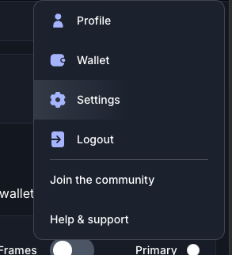

# DSCVR SDK

The DSCVR SDK is a TypeScript library designed to facilitate interactions with the DSCVR platform, leveraging DSCVR's Social Fabric Protocol

## Features

- Users - Create, Read, Update, Delete
- Content - Create, Read, Update, Delete
- Portals - Create, Read, Update, Manage Roles
- Feeds

## Installation


```bash
pnpm install @dscvr-one/dscvr-sdk
```
or
```bash
npm install @dscvr-one/dscvr-sdk
```


## Examples

### Create Identity

Use the output Principal from this script and set it in your DSCVR profile.

1. Goto your user profile settings

2. Click `integrations`

3. Scroll to bottom
4. Set your DSCVR Principal


```ts
import { Ed25519KeyIdentity } from '@dscvr-one/dscvr-sdk';
import fs from 'fs';

const main = () => {
    let identity = Ed25519KeyIdentity.generate();
    console.log('Identity created:', identity.getPrincipal().toString());

    //save the identity to a file in ./.keys/dscvr-identity.json
    fs.writeFileSync('./.keys/dscvr-identity.json', JSON.stringify(identity.toJSON()));

    //load the identity from the file
    let loadedIdentity = Ed25519KeyIdentity.fromJSON(fs.readFileSync('./.keys/dscvr-identity.json').toString());
    console.log('Identity loaded:', loadedIdentity.getPrincipal().toString());
};

main();
```

Example Output
```bash
Identity created: 24xqa-heqzm-pc6yh-cn2kz-635nr-yxgk2-55x6a-5srrd-a4mom-ea4jf-fae
Identity loaded: 24xqa-heqzm-pc6yh-cn2kz-635nr-yxgk2-55x6a-5srrd-a4mom-ea4jf-fae
```

### Get and Update the User

```ts
import { Ed25519KeyIdentity, DSCVRProtocol } from "@dscvr-one/dscvr-sdk";
import fs from "fs";

const main = async () => {
  //Load the identity from the file
  let identity = Ed25519KeyIdentity.fromJSON(
    fs.readFileSync("./.keys/dscvr-identity.json").toString()
  );
  console.log("Identity loaded:", identity.getPrincipal().toString());

  //Create a new DSCVRProtocol instance with the loaded identity
  let protocol = new DSCVRProtocol(identity);

  //Get self
  let selfResult = await protocol.user.getSelf();

  if (selfResult.type === "success") {
    let user = selfResult.data;
    console.log("User:", user);
  } else {
    console.error("Error creating post:", selfResult.error);
  }

  //Update avatar
  let setAvatarResult = await protocol.user.updateAvatar(
    "https://i.ibb.co/nPDRY9q/avatar.png"
  );
  if (setAvatarResult.type === "success") {
    console.log("Avatar updated");
  } else {
    console.error("Error updating avatar:", setAvatarResult.error);
  }

  //Update cover photo
  let setCoverPhotoResult = await protocol.user.updateCoverPhoto(
    "https://i.ibb.co/zPGTXDG/cover-photo.png"
  );
  if (setCoverPhotoResult.type === "success") {
    console.log("Cover photo updated");
  } else {
    console.error("Error updating cover photo:", setCoverPhotoResult.error);
  }

  //Update bio
  let setBioResult = await protocol.user.updateBio(
    "Hello, I'm using the DSCVR SDK!"
  );
  if (setBioResult.type === "success") {
    console.log("Bio updated");
  } else {
    console.error("Error updating bio:", setBioResult.error);
  }
};

main();
```

### Create Post, Get Post, and Edit Post

```ts
import { Ed25519KeyIdentity, DSCVRProtocol } from "@dscvr-one/dscvr-sdk";
import fs from "fs";

const main = async () => {
  //Load the identity from the file
  let identity = Ed25519KeyIdentity.fromJSON(
    fs.readFileSync("./.keys/dscvr-identity.json").toString()
  );
  console.log("Identity loaded:", identity.getPrincipal().toString());

  //Create a new DSCVRProtocol instance with the loaded identity
  let protocol = new DSCVRProtocol(identity);

  //Create a post to your profile
  let postResult = await protocol.content.createSelfPost("Hello, DSCVR!");

  if (postResult.type === "success") {
    let post = postResult.data;
    console.log("Post created:", post.id);
    console.log("Post URL:", `https://dscvr.one/post/${post.id}`);

    //Get the post
    let getContentResult = await protocol.content.getContent(post.id);
    if (getContentResult.type === "success") {
      let content = getContentResult.data;
      console.log("Content:", content);
    } else {
      console.error("Error getting content:", getContentResult.error);
    }

    //Update the post
    let updatePostResult = await protocol.content.updateContent(
      post.id,
      "Hello, DSCVR! Updated"
    );
    if (updatePostResult.type === "success") {
      console.log("Post updated");
    } else {
      console.error("Error updating post:", updatePostResult.error);
    }
  } else {
    console.error("Error creating post:", postResult.error);
  }
};

main();
```

Example Output
```bash
Identity loaded: bug6q-2lwju-tkuip-d76yw-e4zbg-bxt3q-msuuo-c4zso-fgolg-hz4y5-aqe
Post created: 1201410873629868033n
Post URL: https://dscvr.one/post/1201410873629868033
Content: {...}
Post updated
```

### Create Portal
```ts
import { Ed25519KeyIdentity, DSCVRProtocol } from "@dscvr-one/dscvr-sdk";
import fs from "fs";

const main = async () => {
  //Load the identity from the file
  let identity = Ed25519KeyIdentity.fromJSON(
    fs.readFileSync("./.keys/dscvr-identity.json").toString()
  );
  console.log("Identity loaded:", identity.getPrincipal().toString());

  //Create a new DSCVRProtocol instance with the loaded identity
  let protocol = new DSCVRProtocol(identity);

  //Create Portal: cost 500 DSCVR Points
  let portalCreateResult = await protocol.portal.createPortal({
    is_nsfw: false,
    name: "DSCVR SDK Test",
    slug: "dscvr-sdk-test",
    description: "This is a test portal created using the DSCVR SDK",
    icon_url: "https://i.ibb.co/MhkCV6z/portal-example.png",
  });

  if (portalCreateResult.type === "success") {
    let portal = portalCreateResult.data;
    console.log("Portal created:", portal.id);
    console.log("Portal URL:", `https://dscvr.one/p/${portal.slug}`);
  } else {
    console.error("Error creating portal:", portalCreateResult.error);
  }
};

main();
```

Example Output
```bash
Identity loaded: bug6q-2lwju-tkuip-d76yw-e4zbg-bxt3q-msuuo-c4zso-fgolg-hz4y5-aqe
Portal created: 11289821n
Portal URL: https://dscvr.one/p/dscvr-sdk-test
```


### Update Portal and Get Permissions/Roles

```ts
import { Ed25519KeyIdentity, DSCVRProtocol, PermissionBuilder } from "@dscvr-one/dscvr-sdk";
import fs from "fs";

const main = async () => {
  //Load the identity from the file
  let identity = Ed25519KeyIdentity.fromJSON(
    fs.readFileSync("./.keys/dscvr-identity.json").toString()
  );
  console.log("Identity loaded:", identity.getPrincipal().toString());

  //Create a new DSCVRProtocol instance with the loaded identity
  let protocol = new DSCVRProtocol(identity);

  //Get Portal
    let portalResult = await protocol.portal.getPortal("dscvr-sdk-test");
    if (portalResult.type === "success") {
        let portal = portalResult.data;
        console.log("Portal:", portal);

        let isPortalMemberResult = await protocol.portal.isUserPortalMember(portal.id, identity.getPrincipal());
        if (isPortalMemberResult.type === "success") {
            let isMember = isPortalMemberResult.data;
            console.log("Is Portal Member:", isMember);
        } else {
            console.error("Error checking if user is portal member:", isPortalMemberResult.error);
        }

        let getMemberRoleResult = await protocol.portal.getUserPortalRoles(portal.id, identity.getPrincipal());
        if (getMemberRoleResult.type === "success") {
            const portalMember = getMemberRoleResult.data;
            const userPermissions = PermissionBuilder.getFromValue(Number(portalMember.portal.perm));
            console.log("Member Permissions:", userPermissions);
            console.log("Member Roles:", portalMember);
        } else {
            console.error("Error getting user portal roles:", getMemberRoleResult.error);
        }

        //Update Portal Cover Photo
        let updatePortalResult = await protocol.portal.updatePortalCoverPhoto(portal.id, "https://i.ibb.co/m5840kL/portal-cover.png");
        if (updatePortalResult.type === "success") {
            console.log("Portal cover photo updated");
        } else {
            console.error("Error updating portal cover photo:", updatePortalResult.error);
        }

        //Get Portal Roles
        let memberRolesResult = await protocol.portal.getPortalRoles(portal.id);
        if (memberRolesResult.type === "success") {
            let memberRoles = memberRolesResult.data;
            console.log("Member Roles:", memberRoles);
        } else {
            console.error("Error getting portal member roles:", memberRolesResult.error);
        }

    } else {
        console.error("Error getting portal:", portalResult.error);
    }
};

main();
```


### Create and assign Portal Role

```ts
import {
  Ed25519KeyIdentity,
  DSCVRProtocol,
  PermissionFlags,
  ROLE_COLORS,
} from "@dscvr-one/dscvr-sdk";
import fs from "fs";

const main = async () => {
  //Load the identity from the file
  let identity = Ed25519KeyIdentity.fromJSON(
    fs.readFileSync("./.keys/dscvr-identity.json").toString()
  );
  console.log("Identity loaded:", identity.getPrincipal().toString());

  //Create a new DSCVRProtocol instance with the loaded identity
  let protocol = new DSCVRProtocol(identity);

  //role name
  const roleName = "Test Role";

  //Get Portal
  let portalResult = await protocol.portal.getPortal("dscvr-sdk-test");
  if (portalResult.type === "success") {
    let portal = portalResult.data;
    console.log("Portal:", portal);

    //Get all roles
    let rolesResult = await protocol.portal.getPortalRoles(portal.id);
    let testRole = null;
    if (rolesResult.type === "success") {
      let roles = rolesResult.data;
      console.log("Roles:", roles);
      testRole = roles.find((role) => role.name === roleName);
    } else {
      console.error("Error getting portal roles:", rolesResult.error);
    }

    if (!testRole) {
      //Use OR operator to combine permission flags
      let permissionFlag =
        PermissionFlags.CREATE_CONTENT_COMMENT | //allows a user to comment
        PermissionFlags.CREATE_CONTENT_POST | //allows a user to post
        PermissionFlags.REACT_CONTENT; //allows a user to react

      let createRoleResult = await protocol.portal.addPortalRole(portal.id, {
        permissions: BigInt(permissionFlag),
        name: roleName,
        color: ROLE_COLORS["Amber Blaze"], //you can use any color techincally, but this is a list of supported colors by DSCVR
        ordinal: 1n,
        icon_url: "", //not used
      });

      if (createRoleResult.type === "success") {
        testRole = createRoleResult.data;
        console.log("Role created:", testRole);
      } else {
        console.error("Error creating role:", createRoleResult.error);
      }
    }

    if (testRole) {
      //Get user member Roles
      let userMemberResult = await protocol.portal.getUserPortalRoles(
        portal.id,
        identity.getPrincipal()
      );
      if (userMemberResult.type === "success") {
        const portalMember = userMemberResult.data;

        //Add the user to the role, if the user has the role it will not be added again but will return the existing roles
        let addRoleResult = await protocol.portal.addMemberRole(
          portal.id,
          portalMember.member.id,
          testRole.id
        );
        if (addRoleResult.type === "success") {
          let memberViews = addRoleResult.data;
          if (memberViews.length > 0) {
            let hasRole = memberViews[0].roles.find(
              (role) => role.id === testRole.id
            );
            if (hasRole) {
              console.log("User has role:", hasRole);
            } else {
              console.error("User does not have role:", testRole);
            }
          } else {
            console.error("User not found?");
          }
          console.log("Role added to user", addRoleResult.data);
        } else {
          console.error("Error adding role to user:", addRoleResult.error);
        }
      } else {
        console.error(
          "Error getting user portal roles:",
          userMemberResult.error
        );
      }
    }
  } else {
    console.error("Error getting portal:", portalResult.error);
  }
};

main();
```


## Contributing
Contributions are welcome! If you find any issues or have suggestions for improvement, feel free to open an issue or submit a pull request.

## License
This project is licensed under the MIT License.

## Acknowledgements
Special thanks to the DSCVR team for their support and the community for their valuable feedback.

